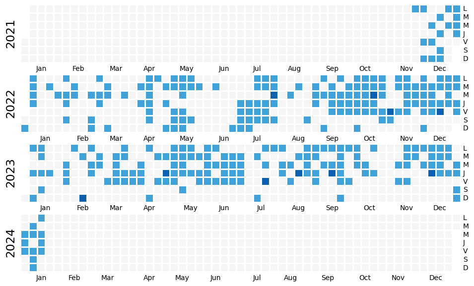

# Gymnalyst.

This is a simple and small repo where I store some scripts for analyzing my gym workouts at Basic-Fit. Feel free to use it for your own purposes.

## Example

Currently, it only features a small notebook to display how many times you've visited Basic Fit with some simple filters. 

Here is an example with my data:

## Retrieving your Basic-Fit data.

1. Log in to [My Basic-Fit](https://my.basic-fit.com/).
2. Go to [My Information](https://my.basic-fit.com/information).
3. Click on "Export my information (JSON)".

This will download a JSON file with your data. Place it in the root of this repo, and then you can use the scripts.

## License

MIT License. Do whatever you want.